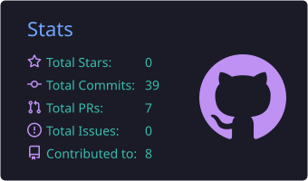
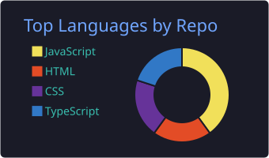
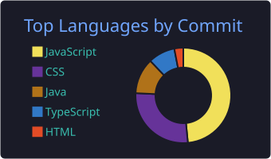
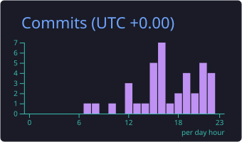

 

## About Me

I'm a **Computer Science student at Cairo University** and a **Full-Stack Web Developer** specializing in the **MEAN Stack** (MongoDB, Express.js, Angular, Node.js) and **React**.

I enjoy building scalable web applications, clean RESTful APIs, and responsive user interfaces, with a focus on writing maintainable code and solving complex technical problems.

## Education & Experience

| | Role | Organization |
|:-:|:--|:--|
| 🎓 | **B.Sc. Computer Science** | Cairo University |
| 🚀 | **MEAN Stack Career Accelerator** | NTI |
| 💼 | **Front-End Development Intern** | Netpoint |

## Tech Stack

**Frontend**

**Backend & Databases**

&nbsp;

**Programming & Computer Science**

&nbsp;

**Tools**

## GitHub Stats

<!--
## Featured Projects

| Project | Description | Tech |
|:--|:--|:--|
| [**Project Name**](https://github.com/Amr-Mahmoud293/repo-name) | One-line description | Angular · Node.js · MongoDB |
| [**Project Name**](https://github.com/Amr-Mahmoud293/repo-name) | One-line description | React · Express · MongoDB |
-->

📧 **[amrelbhar29@gmail.com](mailto:amrelbhar29@gmail.com)** &nbsp;•&nbsp; 💼 **[LinkedIn](https://www.linkedin.com/in/amr-29-elbhar)** &nbsp;•&nbsp; 🐙 **[GitHub](https://github.com/Amr-Mahmoud293)**

